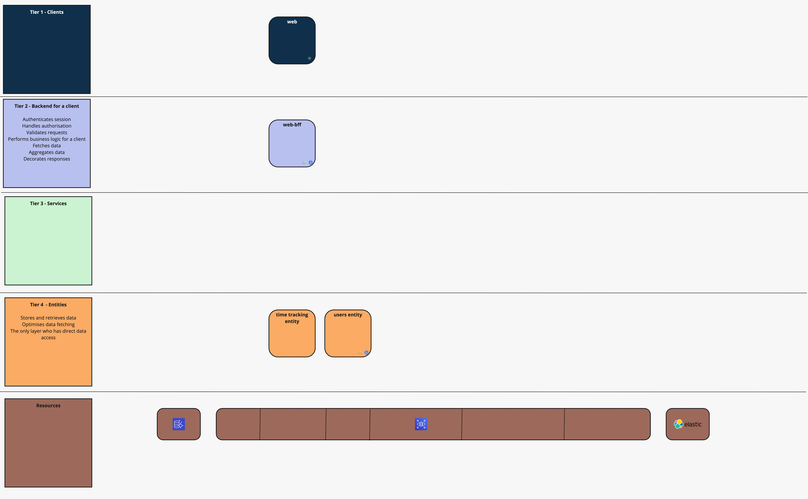

# ToolTime Pagination challenge

Thank you very much for investing your time in the recruitment process of ToolTime. We hope that you will find this one
an interesting way to spend a couple of hours.

## Help needed!


Our microservice-oriented architecture is continuously evolving. The foundation of the system is [4-Tier archtecture](https://www.nginx.com/blog/time-to-move-to-a-four-tier-application-architecture/) which evolves around [DDD](https://en.wikipedia.org/wiki/Domain-driven_design). 
Of course in such setup new challenges arise quickly. One of the trade-offs we had to deal with is that when moving to microservices we lost the way the database deals with transactional operations. 
The other one is that the network adds a bit of latency here and there when we need to communicate over http rather than code.  

Now, none of these issues we will be fixing today. What we ought todo is a to build a feature where we need to show the list of the times where users tracked their work. 
We want to display the first 50 entries, sorted by the last name of the user who had logged the work time.

### Features
As a User 
I want to see the list of 5 time tracking entries logged by the user, sorted by the user's last name. 
So that I can see who worked when. 

### Entities
User: 
```
   id: UUID, 
   firstName: String,
   lastName: String
```

TimeTracking:
```
   id: UUID, 
   startDateTime: LocalDateTime, 
   endDateTime: LocalDateTime, 
   userId: UUID
```

## Good to know
All the services are ready to go and connected. You can spin these up with a simple `docker compose up`
You can play with the BFF API: 

`curl -X GET http://localhost:8083/timetracking` will give you a list of all available time tracking entries
`curl -X GET http://localhost:8083/user` will give you a list of all available users

You can also see the contracts for any respective service, simply check the controllers out.  
